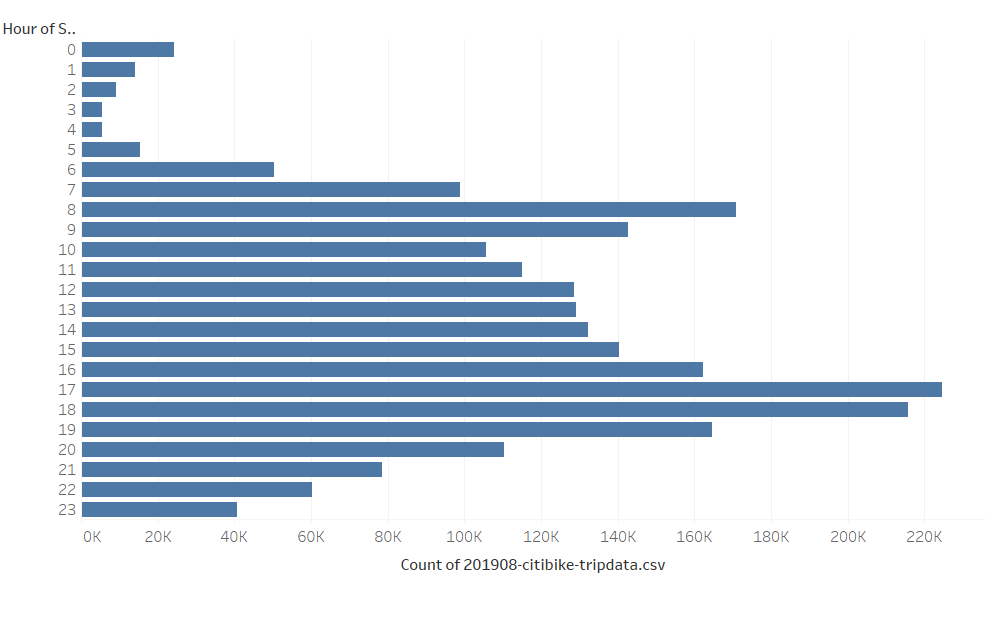
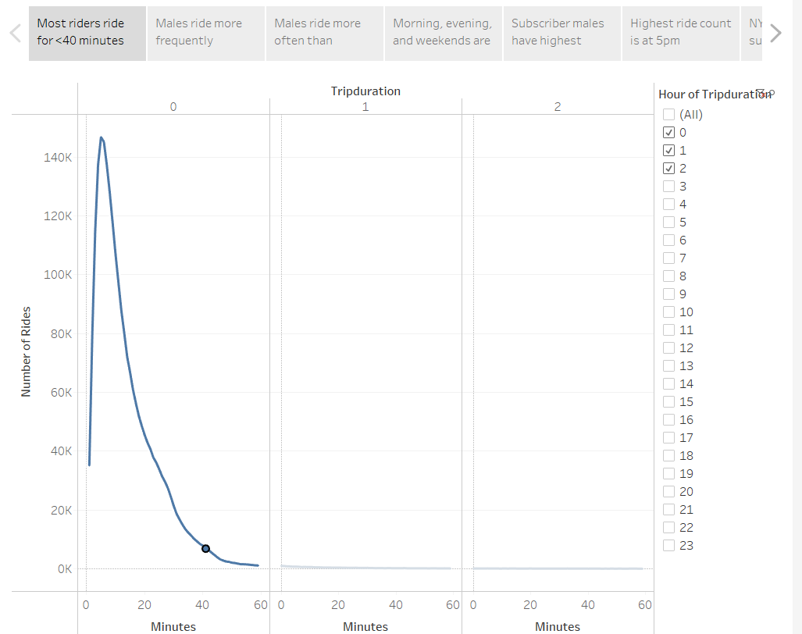
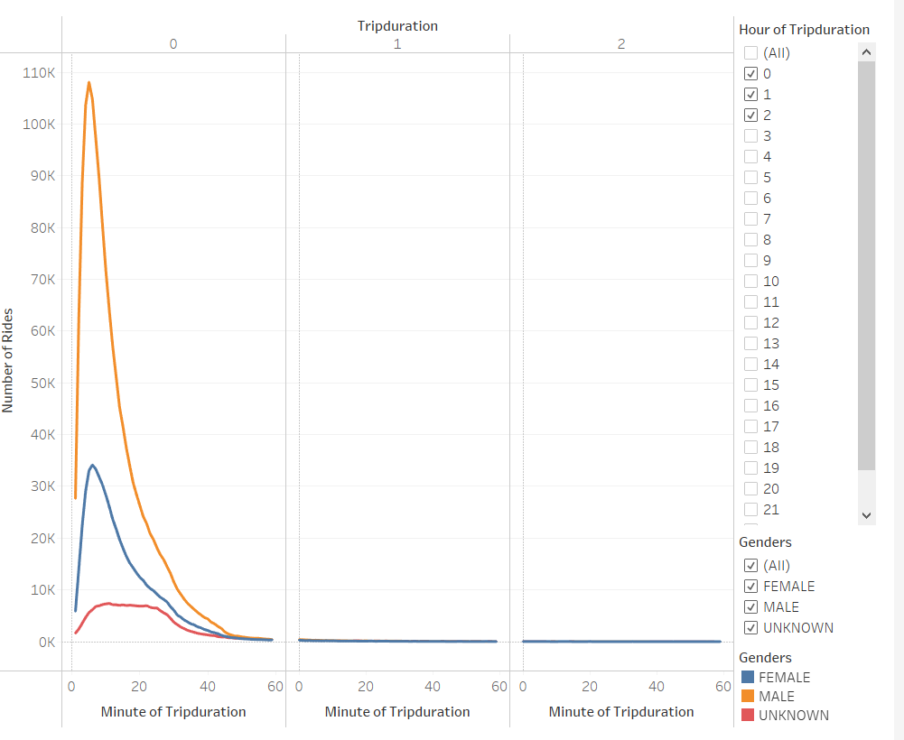
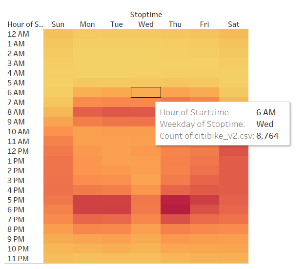
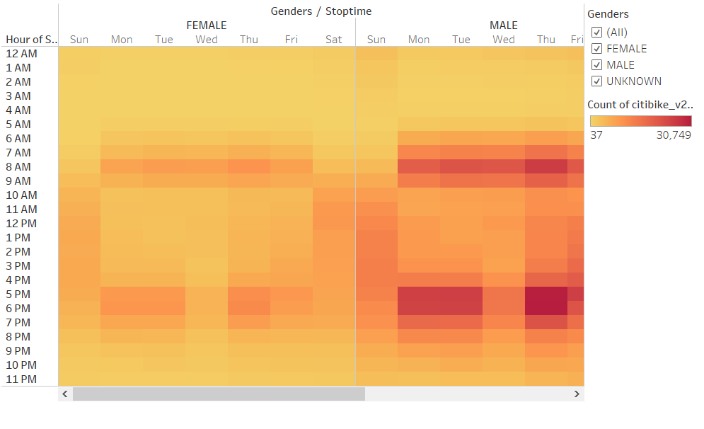
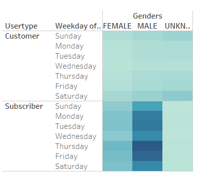
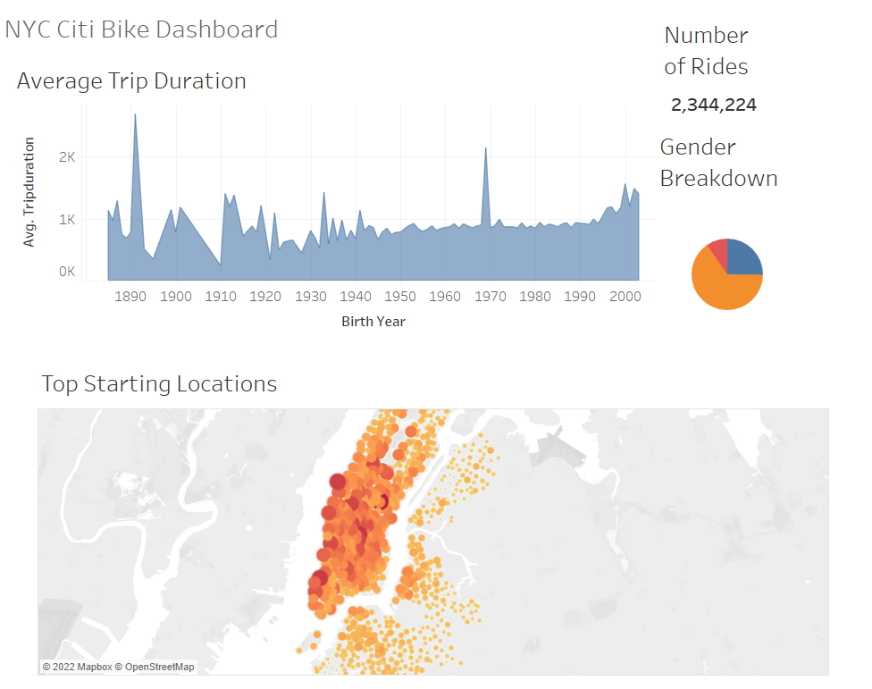

# bikesharing
## Overview
This analysis was performed to investigate a potential bike-sharing start up deployment in Des Moines. After transforming some of the data using the python Pandas library, the remaining analysis was performed using Tableau.

## Results
The results below contain a detailed investigation on ridership through New York City. The information covers preferred ride times throughout the day, gender-distinguished ridership, ride counts for subscribers vs customers, trip durations, and other summaries.

[Link to dashboard](https://public.tableau.com/app/profile/brayden.dodson/viz/bikesharing_analysis_16555290370270/CitibikeAnalysisStory?publish=yes)

### Daily Counts of Riders

### Trip Durations Overall

### Trip Durations by Gender

### Preferred Ride Times Overall

### Preferred Ride Times by Gender

### Subscriber vs. Customer Ridership

### Summary of NYC Ridership

## Summary of Analysis
Due to the significant amount of ridesharing potential in the undersaturated market of Des Moines, I may recommend investing. My recommendation is contingent on the following analyses being performed:
1. Overlay the census population density to filter for regions that have similar population densities to Des Moines. The ridership from these areas will likely better represent Des Moines than the very population dense NYC.
2. Assess the profit margins per gender to determine where ad campaigns can best be targeted and determine what financial benefits a program like this might offer.
